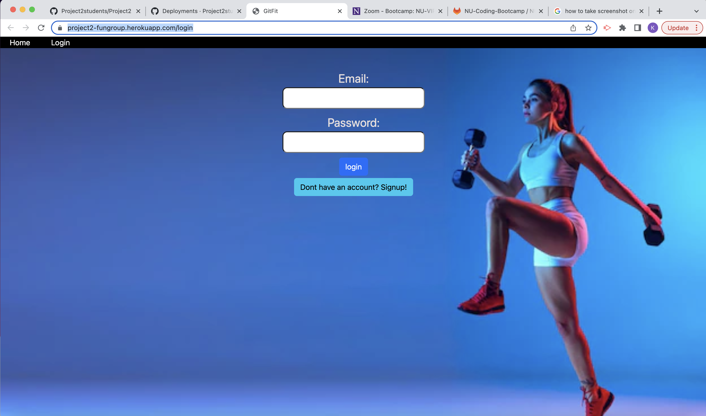

# GitFit
Project #2

## Deployed link to application

https://project2-fungroup.herokuapp.com/login

## Description
Git Fit is a web application that is designed to help users choose their workouts. This app will start on the login page and the existing user can login or a new user can sign up to get them to the home page. From the home page the user can access various workouts for different muscle groups. Once the user creates their personal workout they can save it and view it on the workout page. The workout page includes the users workout history as well as a timer.

## Usage

## Credits
Kalina,
Ray,
Kevin

